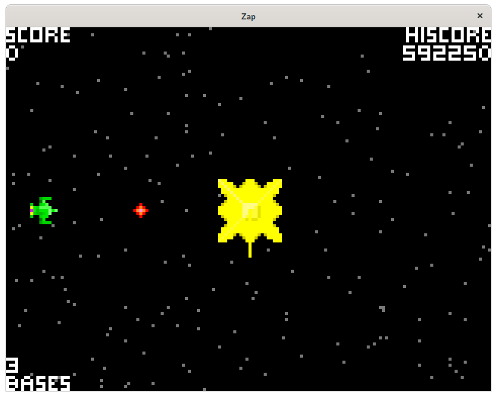

## Zap, a Python version of the 1980 arcade game [*Space Zap*](https://en.wikipedia.org/wiki/Space_Zap)

Defend your space station (yellow) against enemy fighters (green), missiles (red), and attack satellites (blue). Select your gun with the cursor keys and press Space to fire.

The player is awarded a bonus base every 75,000 points.

The window is resizable, press "p" to pause, "." to advance one frame.

## Credits

* Sound effects created with [sfxr](http://www.drpetter.se/project_sfxr.html)
* Intro fanfare created with [PySynth](https://github.com/mdoege/PySynth)
* Graphics created with [GrafX2](http://grafx2.chez.com/) and [GIMP](https://www.gimp.org/)
