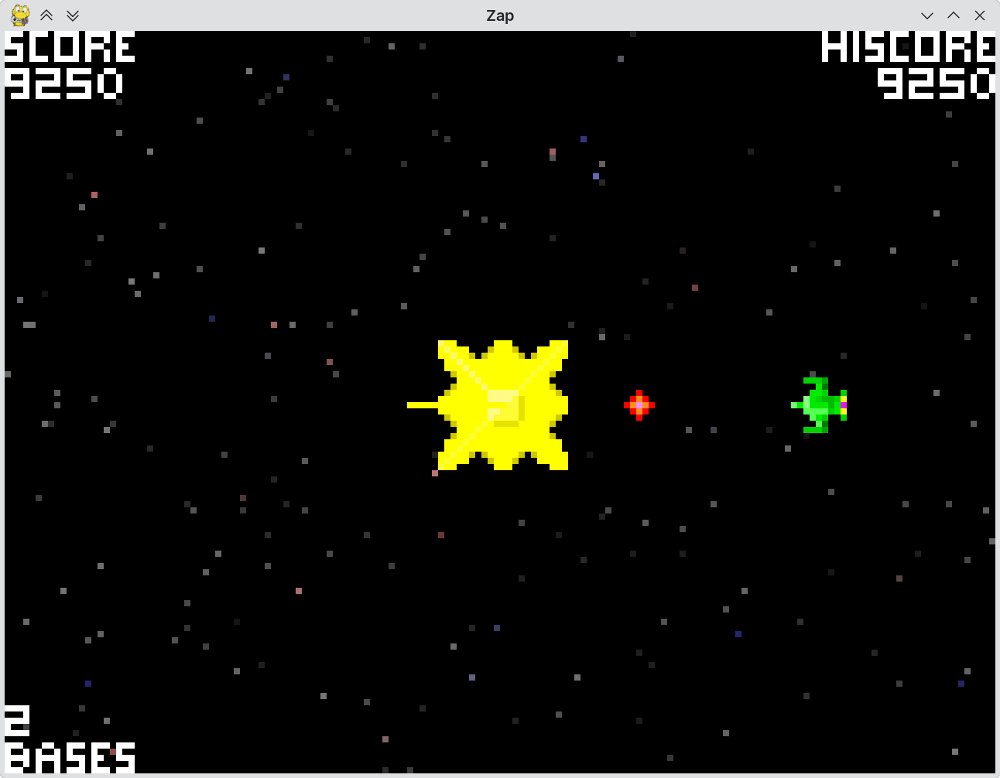

## Zap, a Python version of the 1980 arcade game [*Space Zap*](https://en.wikipedia.org/wiki/Space_Zap)

This game runs in 160x120 resolution which is similar to games on the [Bally Astrocade](https://en.wikipedia.org/wiki/Bally_Astrocade) home console (160x102, with four colors). The Astrocade is the only system that got an official port of *Space Zap* (called *Space Fortress*) at the time.

The window is resizable; press "p" to pause, "." to advance one frame.

### Gameplay

Defend your space station (yellow) against enemy fighters (green), missiles (red), and attack satellites (blue). Aim your gun with the cursor keys and press Space to fire.

The player is awarded a bonus base every 75,000 points.

Gameplay does not copy *Space Zap* exactly, for example the fighters move towards the station and can fire (and be fired at) even when they are still offscreen. Also, attack satellites appear randomly instead of at the end of an attack wave.

### Screenshot

### Credits

* Sound effects created with [sfxr](http://www.drpetter.se/project_sfxr.html)
* Intro fanfare created with [PySynth](https://github.com/mdoege/PySynth)
* Graphics created with [GrafX2](http://grafx2.chez.com/) and [GIMP](https://www.gimp.org/)
